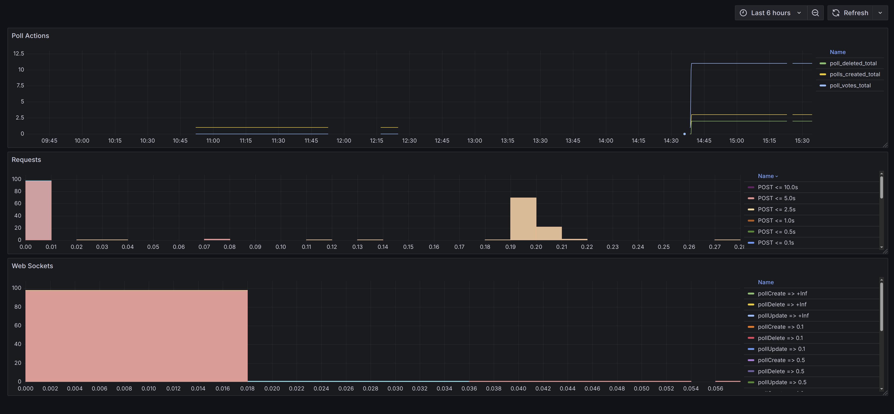
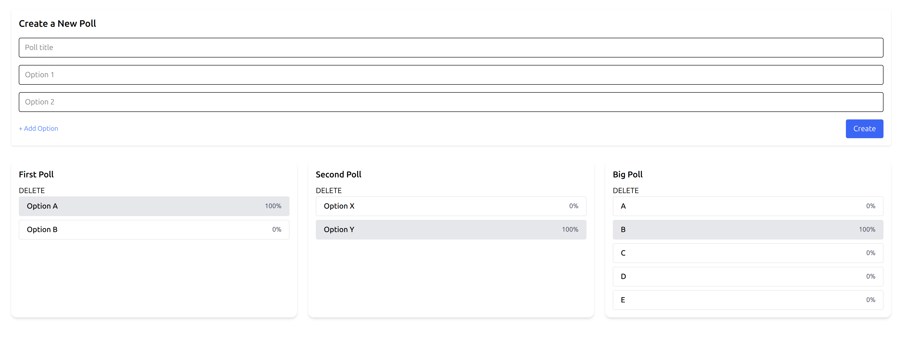

# Prometheus/NesJS Example Project
This is a simple project to demonstrate how to integrate prometheus with a nestjs applications

The exmaple provides a mock polling application that has the following functionality:
- creating polls
- voting on polls
- deleting polls
- loading polls
- websockets for live updating polls
- supporting multiple distinct active users

It is a turborepo composed of:
- `web`: a react vite application that handles the IO
- `api`: a NestJS application that provides the backend to the application

It also includes a `docker-compose` with the following services:
- `prometheus`
- `grafana`
- `postgresDb`

## Screenshots

| Prometheus View | Web Application View |
|-----------------|-----------------------|
|  |  |

## Running the app
1. In the `/monitoring` directory run `generate_prometheus_config.sh <development|producation>`
2. Boot the docker containers with `docker compose up grafana db prometheus --build 
3. Boot the web app with `pnpm run dev`

## Key Integrations/Files for premethus
1. Metrics.service.ts: registers metrics with promethues and provides methods for updating metrics
2. Request-metrics.interceptor.ts: catches and sends request data to prometheus
3. poll.gateway.ts: sends metrics based on webhook activity
4. prometheus.yml defines the target for metrics and how often to scrape

## Disclaimers:
- As this is an example app I've left auto sync and delete on in TypeORM so no migrations exist in this project and data is wiped every time you restart the web app
- Sample app isn't up to the greatest of code standards as the key area of relevance for this repo is the prometheus integration

